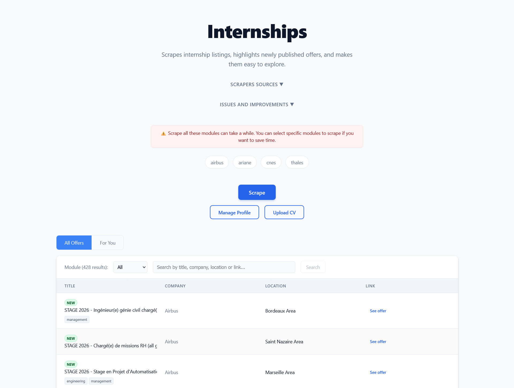

<h1 align="center">InternApp</h1>

<p align="center">
  
</p>

A full‑stack project to scrape internship listings from multiple sources and browse them via a React UI with **personalized job recommendations**.

## Project Structure

```
InternApp/
├─ backend/
│  ├─ main.py                # FastAPI app with routes
│  ├─ scrapers/              # Site-specific scrapers (e.g. Ariane, Airbus)
│  ├─ config.py              # Configuration and scraper registration
│  ├─ profile_manager.py     # User profile management
│  ├─ scoring_engine.py      # Job relevance scoring algorithm
│  ├─ cv_parser.py           # AI-powered CV analysis
│  ├─ tagging_service.py     # Job categorization and tagging
│  ├─ (jobs.json)            # Persisted job results
│  ├─ (user_profile.json)    # User preferences and profile data
│  ├─ requirements.txt       # Python deps (FastAPI, Playwright, etc.)
│  └─ Dockerfile             # Uvicorn dev server, Playwright base image
├─ frontend/
│  ├─ src/
│  │  ├─ components/         # React components (ProfileManager, CVUploader, etc.)
│  │  ├─ contexts/           # React contexts (NotificationContext)
│  │  └─ ...                 # React + Vite + TS
│  ├─ package.json           # Scripts and deps
│  └─ Dockerfile             # Vite dev server
├─ docker-compose.yml        # Orchestrates backend and frontend
└─ README.md
```

## Tech Stack

- **Backend**: `FastAPI`, `Uvicorn`, `Playwright` (Python), `httpx` (async requests), `BeautifulSoup4`, `Groq API` (AI)
- **Frontend**: `React`, `Vite`, `TypeScript`, `CSS Modules`
- **Dev/Runtime**: Docker, docker-compose

## Features

### Core Job Scraping
- **Multi-Source Scraping**: Scrapes job listings from various company websites.
- **Selective Scraping**: Allows users to select specific sources to scrape, saving time.
- **Job Filtering**: Filter jobs by source module to narrow down the results.
- **Full-Text Search**: Search for jobs by keywords in the title, company, or location.
- **New Job Highlighting**: Newly scraped jobs are marked with a "New" badge.
- **Pagination**: Browse through a large number of job listings with ease.

### Personalization
- **Personalized "For You" Feed**: AI-driven job recommendations based on user preferences
- **Intelligent Scoring Algorithm**: Jobs scored by tag matches (+10), location preference (+5), and recency (+2)
- **Profile Management**: Complete user profile system with preferences and skills
- **CV Upload & Analysis**: AI-powered CV parsing to automatically extract skills and update profile
- **Real-time Recommendations**: Profile changes immediately update personalized job feed

### 🛠️ System Features
- **Feedback Loop**: "Issues and Improvements" toggle to report broken scrapers or suggest features.
- ⏳**AI-Powered Diagnostics**: Automatically generates detailed error analysis and fix suggestions using Groq LLM when a scraper fails.

## Getting Started

### Option A: Run with Docker (recommended)

Prereqs: Docker Desktop.

```bash
docker-compose up --build
```
*or*
```bash
docker compose up --build
```

- **Frontend**: http://localhost:5173
- **Backend API**: http://localhost:8000


### Option B: Run locally

**Backend**
1. (Optional) Create and activate a Python venv.
2. Install deps:
   ```bash
   pip install -r backend/requirements.txt
   ```
3. Install Playwright browsers (one-time):
   ```bash
   python -m playwright install
   ```
4. Start API:
   ```bash
   uvicorn backend.main:app --reload --port 8000
   ```

**Frontend**
1. Install Node 20+.
2. Install deps:
   ```bash
   cd frontend
   npm install
   ```
3. Start dev server:
   ```bash
   npm run dev
   ```
4. Open http://localhost:5173

## API Reference (backend)

Base URL: `http://localhost:8000`

### Job Endpoints

- **`GET /jobs`**
Returns a paginated, filterable, and searchable list of all jobs.
  - **Query Parameters**:
    - `page` (int, default: 1): The page number to retrieve.
    - `size` (int, default: 10): The number of jobs per page.
    - `modules` (string, optional): A comma-separated list of module names to filter by (e.g., `airbus,thales`).
    - `search` (string, optional): A search term to filter jobs by title, company, or location.

- **`GET /jobs/for-you`**
Returns personalized job recommendations based on user profile.
  - **Query Parameters**: Same as `/jobs`
  - **Additional Response Fields**:
    - `match_score` (int): Relevance score for each job
    - `matching_tags` (array): Tags that matched user preferences
  - **Note**: Returns empty results with message if no profile is configured

- **`GET /modules`**
Returns a list of available scraper modules (e.g., `["airbus", "ariane", "cnes", "thales"]`).

### Profile Management Endpoints

- **`GET /profile`**
Returns the current user profile.
  - **Response**:
  ```json
  {
    "tags": ["software", "aerospace"],
    "location": "Paris",
    "groq_api_key": "optional_api_key"
  }
  ```

- **`POST /profile`**
Updates the user profile.
  - **Body** (JSON):
  ```json
  {
    "tags": ["software", "engineering"],
    "location": "Paris",
    "groq_api_key": "optional_key"
  }
  ```

- **`DELETE /profile`**
Resets user profile to default empty state.
  - **Response**: Default empty profile

- **`POST /profile/parse-cv`**
Uploads and analyzes a CV to extract skills and update profile.
  - **Body**: Multipart form data with:
    - `file`: PDF file (max 10MB)
    - `api_key`: Groq API key for analysis
    - `merge_with_existing`: Boolean to merge or replace tags
  - **Response**:
  ```json
  {
    "success": true,
    "extracted_tags": ["python", "react"],
    "final_tags": ["software", "python", "react"],
    "profile": {...},
    "cv_preview": "CV content preview..."
  }
  ```

### Scraping Endpoints

- **`POST /scrape`**
Triggers a scrape of all available modules.
  - Merges new jobs with existing ones, marks them as `new: true`, and saves to `jobs.json`.
  - **Response**:
  ```json
  {
    "added": 5,
    "total": 120,
    "failed_scrapers": ["cnes"]
  }
  ```

- **`POST /scrape_modules`**
Triggers a scrape of only the specified modules.
  - **Body** (JSON):
  ```json
  {
    "modules": ["airbus", "thales"]
  }
  ```
  - **Response**: Same format as `/scrape`.

### Job Item Structure

```json
{
  "module": "ariane",
  "company": "Ariane",
  "title": "Stage - Ingénieur Logiciel",
  "link": "https://...",
  "location": "Meudon",
  "new": true,
  "tags": ["software", "engineering"],
  "match_score": 17,
  "matching_tags": ["software"]
}
```

**Note**: `match_score` and `matching_tags` are only present in `/jobs/for-you` responses.

## Personalized Job Filtering

### How It Works
1. **Profile Setup**: Users configure their preferences (skills, location) via the Profile Manager
2. **CV Analysis**: Optional AI-powered CV upload to automatically extract skills
3. **Intelligent Scoring**: Jobs are scored based on:
   - **Tag Matches**: +10 points per matching skill/category
   - **Location Match**: +5 points for preferred location
   - **New Jobs**: +2 points for recently posted positions
4. **Personalized Feed**: "For You" tab shows jobs ranked by relevance score

### Profile Management
- **Visual Indicators**: Unsaved changes marked with asterisk (*)
- **Factory Reset**: Complete profile clearing via "Reset to Default"
- **Real-time Sync**: Changes immediately update job recommendations
- **Global Notifications**: Success/error feedback with auto-dismiss

### CV Upload & Analysis
- **AI-Powered**: Uses Groq API for intelligent skill extraction
- **Flexible Integration**: Merge with existing preferences or replace completely
- **Progress Feedback**: Context-aware loading states during analysis
- **Secure**: API keys stored locally, used only for analysis

## Data and Persistence

- **Job Data**: The backend stores results in `backend/jobs.json`.
- **User Profile**: Profile data persisted in `backend/user_profile.json`.
- **Deduplication**: Existing links are deduplicated on subsequent scrapes; existing items have `new: false` while newly found items are marked `new: true`.
- **Profile Persistence**: User preferences survive browser sessions and application restarts.

## Contributing

If you want to contribute to this project (add new scrapers, fix bugs, etc.), please open an issue or submit a pull request. Read the [scraper maintenance guide](./backend/scraper_maintenance.md) for implementation details.

## License

<p>
<a href="./LICENSE">MIT License</a>
</p>
