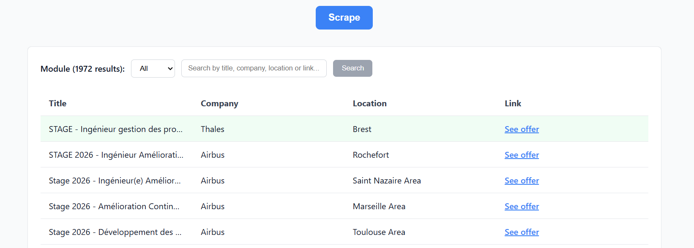

<h1 align="center">InternApp</h1>

<p align="center">
  
</p>

A full‑stack project to scrape internship listings from multiple sources and browse them via a React UI.

## Project Structure

```
InternApp/
├─ backend/
│  ├─ main.py                # FastAPI app with routes
│  ├─ config.py              # Configuration and scraper registration
│  ├─ scrapers/              # Site-specific scrapers (e.g. Ariane, Airbus)
│  ├─ (jobs.json)            # Persisted job results
│  ├─ requirements.txt       # Python deps (FastAPI, Playwright, etc.)
│  └─ Dockerfile             # Uvicorn dev server, Playwright base image
├─ frontend/
│  ├─ src/                   # React + Vite + TS
│  ├─ package.json           # Scripts and deps
│  └─ Dockerfile             # Vite dev server
├─ docker-compose.yml        # Orchestrates backend and frontend
└─ README.md
```

## Tech Stack

- **Backend**: `FastAPI`, `Uvicorn`, `Playwright` (Python), `httpx` (async requests), `BeautifulSoup4`
- **Frontend**: `React`, `Vite`, `TypeScript`, `CSS Modules`
- **Dev/Runtime**: Docker, docker-compose

## Features

- **Multi-Source Scraping**: Scrapes job listings from **Airbus**, **Ariane**, **CNES**, and **Thales**.
- **Selective Scraping**: Choose specific modules to scrape (e.g., only "Airbus" and "Thales") via the UI or API.
- **Job Filtering**: Filter jobs by source module to narrow down the results.
- **Full-Text Search**: Search for jobs by keywords in the title, company, or location.
- **New Job Highlighting**: Newly scraped jobs are marked with a "New" badge.
- **Pagination**: Browse through job listings with customizable page sizes.
- **Feedback Loop**: "Issues and Improvements" toggle to report broken scrapers or suggest features.
- **Loading States**: Visual feedback during long scraping processes.

## Getting Started

### Option A: Run with Docker (recommended)

Prereqs: Docker Desktop.

```bash
docker-compose up --build
```
*or*
```bash
docker compose up --build
```

- **Frontend**: http://localhost:5173
- **Backend API**: http://localhost:8000

### Option B: Run locally

**Backend**
1. (Optional) Create and activate a Python venv.
2. Install deps:
   ```bash
   pip install -r backend/requirements.txt
   ```
3. Install Playwright browsers (one-time):
   ```bash
   python -m playwright install
   ```
4. Start API:
   ```bash
   uvicorn backend.main:app --reload --port 8000
   ```

**Frontend**
1. Install Node 20+.
2. Install deps:
   ```bash
   cd frontend
   npm install
   ```
3. Start dev server:
   ```bash
   npm run dev
   ```
4. Open http://localhost:5173

## API Reference (backend)

Base URL: `http://localhost:8000`

### GET /jobs
Returns a paginated, filterable, and searchable list of jobs.
- **Query Parameters**:
  - `page` (int, default: 1): The page number.
  - `size` (int, default: 20): Jobs per page (max 100).
  - `modules` (string, optional): Comma-separated list of module names (e.g., `airbus,thales`).
  - `search` (string, optional): Search term for title, company, or location.

### GET /modules
Returns a list of available scraper modules (e.g., `["airbus", "ariane", "cnes", "thales"]`).

### POST /scrape
Triggers a scrape of **all** available modules.
- **Response**:
  ```json
  {
    "added": 5,
    "total": 120,
    "failed_scrapers": ["cnes"]
  }
  ```

### POST /scrape_modules
Triggers a scrape of only the specified modules.
- **Body** (JSON):
  ```json
  {
    "modules": ["airbus", "thales"]
  }
  ```
- **Response**: Same format as `/scrape`.

### Job Item Shape
```json
{
  "module": "ariane",
  "company": "Ariane",
  "title": "Stage - Ingénieur Logiciel",
  "link": "https://...",
  "location": "Meudon",
  "new": true
}
```

## Data and Persistence

- The backend stores results in `backend/jobs.json`.
- Existing links are deduplicated; new items are marked `new: true`.

## Contributing

If you want to contribute to this project (add new scrapers, fix bugs, etc.), please open an issue or submit a pull request. Read the [Scraper Maintenance Guide](./backend/scraper_maintenance.md) for implementation details.

## License

<p>
<a href="./LICENSE">MIT License</a>
</p>
